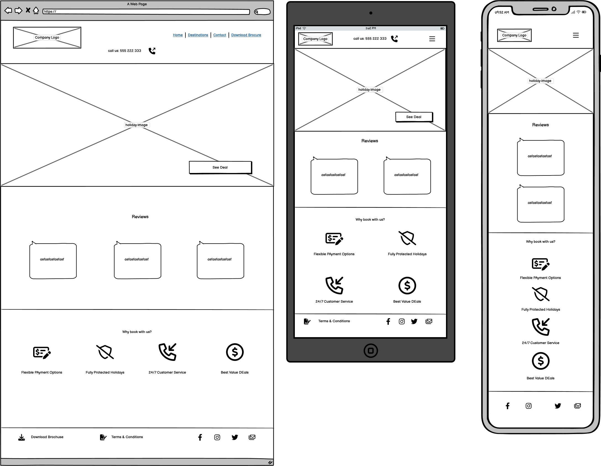
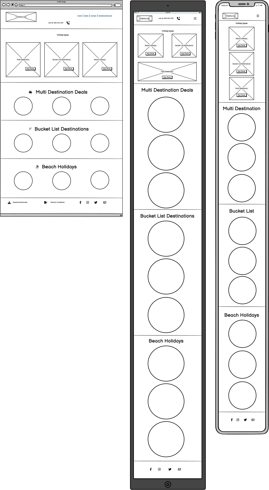
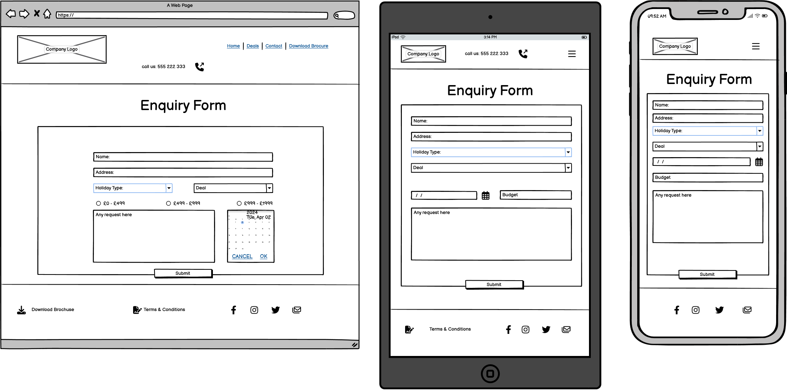

## Introduction

Hi there, 

Get2Go Holidays is a made up travel agent website. It was created for educational purpose as my first milestone project for Code Institute's Web Development course.

It is a static website developed using html, css and bootstrap. The content of the site is limited for simplicity , however fully scalable for future extensions.

## UX

The metholody of UXD was used in the planning and development of the project. 
The choosen project is a travel agent's website to advertise and generate leads for bookings as part of a franchise. As code institute's first milestone project, an at least 3 page static website was required.

### Technologies and Tools Used

* Languages

    * HTML
    * CSS

* Framework

    * Bootstrap

* Version Control

    * Git
    * Github
    * Gitpod

* additional resources
    * FontAwesome: fonhttps://fontawesome.com/search?o=r&m=free&s=solid  - used for icons throughout the site
    * ChatGPT: https://chat.openai.com/   - used to create content for the brochure

### Objective

* The main objective of the website is to establish an online presence and create leads that can be converted into sales

### Research

Get2Go holidays was a side hussle of mine, while it eventually failed it is the base of the idea of this project. 

In order to gain a good understanding of the requirements I conducted a research and visited several travel websites to evaluate what is working and what isn't. The results of this research along with requirements of the milestone project form the base of all the features included.

Websites and travel agents visisted for research:

* [CruiseNation](https://www.cruisenation.com/)
* [THG Holidays](https://www.thgholidays.co.uk/)
* [TUI](https://www.tui.co.uk/)
* [Loveholidays](https://www.loveholidays.com/)
* [On the beach holidays](https://www.onthebeach.co.uk/)
* [LuxuryEscapes](https://luxuryescapes.com/gb)

### Target Audience

Generally the target audience for an online agency are people with no specific plans/destination in mind yet but looking to explore. It includes individuals as well as groups looking for help to organise the travel plans. 
Get2Go holidays is thought to be an independent agency/agents and based on the research conducted best targetting couples with out of ordinary itineraries such as multi-destnation breaks and bucketlist destinations.

### User Stories

* User story 1:
* User story 2:

### Scope

Viabaility Chart: Insert table here ( viability vs importance )

### Structure and Design

* Layout: The general layout of the site created using bootstrap and breaks into 3 section. A header, a footer and a main section on each page. The header and footer is designed to be straight forward with logo and navigation while the footer is to present a number of alternative way to see the agency through social links and include action button and "other" informtion such as terms and conditions. Both header and footer are the same throughout the site to ensure consistency.

* Features:

    * Header: The header contains a company logo , a call to action button and the main navigation bar.

    * Footer: Main feature in this section is the clicable social media icons providing an alternative way to see and contact the company. The footer also home for a terms and conditions link( pop up widow with details) and a button to download brochure.

    * Main Page: index.html - present an overall look of the site, showcasing a hero image with eye catching holiday pictures and call to action buttons( see deals), which also provide an alternative way( other than nav bar) to navigate to the holidays.html page. The main page also includes a section of reviews and reasosns to book with us.
    * Deals Page: presents main holiday categories for user such as multi-destination or bucket-list holidays with large clickable pictures/icons that navigates the user to the second section of the page where all actual deals are avaialble. All deals containers include a see deal button that has a pop-up window with the holiday details.
    * Enquiry Page: The enquiry page's main section have a form , where users can submit holiday requests/questions based on prefered dates, destination and budget. Upon submitting a form a thank you landing page is presented with navigation to return to main site.
    * Landing Page: A thank you page letting customers knnow that their enquiry form had been successfully submitted and present an additional button to return to home page.
 
    * Download Brochure: clickable link to download a brochure with all existing deals. The feature presented in multiple location, namely once in the navigation bar and once in the footer area.

* Design Choices:

    * Color: I chose vibrant summer colors to implement a "good feel" vibe when visiting the page, the approach for these choices were guided by the original website(no longer exist, was provided by franchise at the time) colors and logo.
    * Font: choices to be presented here

* Interaction Design:

work flow graph/ image added here

* Wireframes:

Home

Destinations

Enquiry

Landing Page

## Testing/Bugs/Fixes

## Media

Below are the links to all images used for the brochure and throughout the website.

*Pixabay: https://pixabay.com/images/search/webpage/

*https://pixabay.com/photos/barbados-word-text-handwriting-70753/
*https://pixabay.com/photos/indonesia-bali-ulun-danu-1578647/
*https://pixabay.com/photos/eiffel-tower-paris-france-3349075/  
*https://pixabay.com/photos/tiber-bridge-rome-bridge-italy-2263361/
*https://pixabay.com/photos/church-santorini-d-greece-island-2020258/
*https://pixabay.com/photos/mykonos-santorini-paros-greece-7317855/
*https://pixabay.com/photos/bridge-manhattan-brooklyn-new-york-370542/
*https://pixabay.com/photos/peru-mountains-machu-picchu-2135770/
*https://pixabay.com/photos/hollywood-united-states-los-angeles-573444/
*https://pixabay.com/photos/seychelles-indian-ocean-vacations-215253/
*https://pixabay.com/photos/sydney-opera-house-sydney-354375/
*https://pixabay.com/photos/beach-resort-jetty-pier-boardwalk-666122
*https://pixabay.com/photos/beach-ocean-waves-coast-shore-5531919/

## Credits

all code snippets used from other sources referenced here

---

