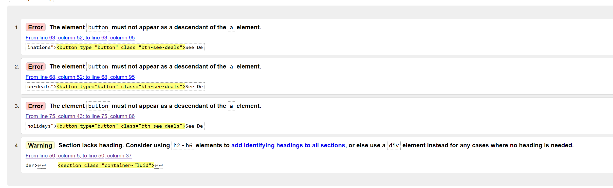
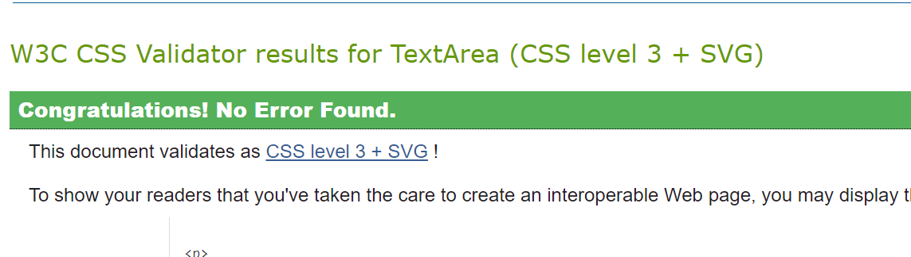

## Introduction

Hi there, 

Get2Go Holidays is a made up travel agent website. It was created for educational purpose as my first milestone project for Code Institute's Web Development course.

It is a static website developed using html, css and bootstrap. The content of the site is limited for simplicity , however fully scalable for future extensions.

## **[GET2GO Holidays Live Site](https://zoltanszarvas0209.github.io/mp1_get2go_holidays/)**

## **[Repository](https://github.com/ZoltanSzarvas0209/mp1_get2go_holidays.git)**

## Table of contents

 1. [ UX ](#ux)
 2. [ Technologies and Tools ](#technologies)  
 3. [ Objective ](#objective)  
 4. [ Research ](#research) 
 5. [ Target Audience ](#audience)  
 6. [ User Stories ](#user)
 7. [ Structure and Design ](#design)
     - [ Layout ](#layout)
     - [ Features ](#features)
     - [ Design Choices ](#designchoice)
     - [ Wireframes ](#wireframes)
 9. [ Deployment ](#deployment)
 10. [ Testing/Bugs/Fixes ](#testing)
     - [ HTML and CSS Validation](#htmlandcss)
     - [ Testing ](#alltesting)
          - [ Pre-deployment ](#predeployment)
          - [ post-deployment ](#postdeployment)
     - [ User Testing ](#usertest)
     - [ Testing User Stories](#testinguserstories)
     - [ Accessibility ](#access)
 11. [ Media ](#media)
 12. [ Credits ](#credit)  

## UX 

The methology of UXD was used in the planning and development of the project. 
The choosen project is a travel agent's website to advertise and generate leads for bookings as part of a franchise. As code institute's first milestone project, an at least 3 page static website was required.

### Technologies and Tools Used 

* Languages

    * HTML
    * CSS

* Framework

    * Bootstrap

* Version Control

    * Git
    * Github
    * Gitpod

* additional resources
    * FontAwesome: fonhttps://fontawesome.com/search?o=r&m=free&s=solid  - used for icons throughout the site
    * ChatGPT: https://chat.openai.com/   - used to create content for the brochure
    * Google Fonts: https://fonts.google.com/selection/embed - used Open sans font family

### Objective 

* The main objective of the website is to establish an online presence and create leads that can be converted into sales

### Research 

Get2Go holidays was a side hussle of mine, while it eventually failed it is the base of the idea of this project. 

In order to gain a good understanding of the requirements I conducted a research and visited several travel websites to evaluate what is working and what isn't. The results of this research along with requirements of the milestone project form the base of all the features included.

Websites and travel agents visisted for research:

* [CruiseNation](https://www.cruisenation.com/)
* [THG Holidays](https://www.thgholidays.co.uk/)
* [TUI](https://www.tui.co.uk/)
* [Loveholidays](https://www.loveholidays.com/)
* [On the beach holidays](https://www.onthebeach.co.uk/)
* [LuxuryEscapes](https://luxuryescapes.com/gb)

### Target Audience 

Generally the target audience for an online agency are people with no specific plans/destination in mind yet but looking to explore. It includes individuals as well as groups looking for help to organise the travel plans. 
Get2Go holidays is thought to be an independent agency/agents and based on the research conducted best targetting couples with out of ordinary itineraries such as multi-destnation breaks and bucketlist destinations.

### User Stories 

* User story 1:
    - As a customer at a fantasising/planning stage of a Holiday:

        1. I am looking for inspiration of where to go.
        
        2. I am looking for a peace of mind about holiday security/reliability
        
        3. I want to see feedback from previous customers to have a better idea what to expect.
       
        4. I want to see a range of prices so I can make an informed decision before I progress further.

* User story 2:
    - As a customer ready to pick a package/book a Holiday:

        1. I am looking for a good selection of destinations with guide prices

        2. I am looking to be able to submit my specific requests and get my quotes.

        3. I want to see options to get in touch should I wish to progress or my requirements have changed.

### Structure and Design 

* Layout:   The general layout of the site created using bootstrap and breaks into 3 section. A header, a footer and a main section on each page. The header and footer is designed to be straight forward with logo and navigation while the footer is to present a number of alternative way to see the agency through social links and include action button and "other" informtion such as terms and conditions. Both header and footer are the same throughout the site to ensure consistency.

* Features: 

    * Header: The header contains a company logo , a call to action button and the main navigation bar.
      

Screenshot of header

          
          

        * Logo : responsive image of the logo of the company.
        * Contact : call to action implemented with clickable phone number.
        * Navbar : Main navigation feature of the whole site allowing users to easily move around as desired.

    * Footer: Main feature in this section is the clicable social media icons providing an alternative way to see and contact the company. An e-mail icon can also be found that will take the user to send an e-mail to Get2Go Holidays. The footer also home for a terms and conditions as weel as the download brochure link( both downloaded as a word.doc.
      

Screenshot of footer

          
          

    * Main Page: index.html - present an overall look of the site, showcasing a hero image with eye catching holiday pictures and call to action buttons( see deals), which also provide an alternative way( other than nav bar) to navigate to the holidays.html page. The main page also includes a section of reviews and reasosns to book with us. 
        * Carousel: a slideshow of the main holiday categories, catch users attention quickly.
         

Screenshot of carousel

          
          

        * Testimonials: a display of feedback from previous customers.
        

Screenshot of testimonials

          
          

        * Why book with us: a selection of feature the company offers for peace of mind.
        

Screenshot of header

          
          

    * Deals Page: presents main holiday categories for user such as multi-destination or bucket-list holidays with large clickable pictures/icons that navigates the user to the second section of the page where all actual deals are avaialble.All holiday types section includes a button to the relating section for ease of navigation. An up arrow indicating the user to move up is also added( decision made after testing and added at the end of the project due testing revaling issue with extended scrolling on small screens.
      

Screenshot of holiday types

          
          

          

Screenshot of holidaysections.png

          
          

          

Screenshot of up arrow for navigation

          
          

    * Enquiry Page: The enquiry page's main section have a form , where users can submit holiday requests/questions based on prefered destinations and budget. Upon submitting a form a thank you landing page is presented with navigation to return to main site.
      

Screenshot of form

          
          

    
    * Landing Page: A thank you page letting customers knnow that their enquiry form had been successfully submitted.
      

Screenshot of thank you page

          
          

 
    * Download Brochure: clickable link to download a brochure with all existing deals. The feature presented in multiple location, namely once in the navigation bar and once in the footer area.

* Design Choices: 

    * Color: I chose vibrant summer colors to implement a "good feel" vibe when visiting the page, the approach for these choices were guided by the original website(no longer exist, was provided by franchise at the time) colors and logo.

    *  #b10303, rgba(255,0,0,0.2), rgba(255,0,0,0.4), #c5b720, #faf6f6ce, #FFFFFF

    * Font: I choose the font family Open-sans, sans-serif, as I found it suited the site well with san-serif in place as the fall back option.

* Wireframes: 

Wireframes below were the original design, however the final product do feature some minor difference as alternative solutions were choosen and additional features implemented during development.

Home

Destinations

Enquiry

Landing Page

### Deployment 

To Deploy a project from your github repesatory, foloow the steps below.

 1. Login to your GitHub account.
 2. Click on the repository you would like to deploy.
 3. Clcik Settings on the top navigation bar. 
 4. Then select Pages on the side navigation bar.
 5. Under Build and Deployment/ Source click on the first dropdown menu and select Deploy from a branch.
 6. Under branch click the first dropdown menu and select main.
 7. Under the second dropdown menu select /(root).
 8. Select Save.

    The github page now is alive!.

## Testing/Bugs/Fixes 

### HTML and CSS validation: 

1. index.html:
    - 

 Screenshot of result

         
        
 

        1. illegal space character removed - same error present in all pages and rectified
        2. area hidden atribute not allowed - same error present in all pages and removed

    - 

 Screenshot of result after fix

         
        

2. destination.html:
    - 

 Screenshot of result

         
        

        1. button element error - element was removed and link wrapped in  tag. text-align: center; and padding-top: 5px; was also added to btn-see-deals to reposition button.
        2. section lacks heading warning: decided not to address this further as code was used from external source( referenced in credit section).

    - 

 Screenshot of result after fix

         
        

3. enquiry.html : Passed validator

    - 

 Screenshot of result after fix

         
        

4. landing.html: Passed Validator

    - 

 Screenshot of result after fix

         
        

5. CSS Validator: Pass with no errors.
    - 

 Screenshot of result

         
        

### Testing 

#### Initial testing items below arose during development and most were dealt with at the time.  

1. Responsive layout issue: sections are overlaying when testing small devices.
    - Solution: sections where given specific heights in px when initial code was written, changed width and height to %. This has solved the issue with the site responsivness.

2. The header appeared to have an unintentional over reach on the side of the nav bar area:
    - Solution: Investigated issue with the help of Developer Tools and found that I missed the bootstrap container in the header section "container-fluid", added it on to each page and this had fixed the issue.
        

 Picture of issue:

        
        
 

3. Hamburger icon and toggle not working: Original implementation used bootstrap provided code to create hamburger icon toggle feature. This had later been scrapped as the course dos not require javascript to be used and found this was not justifyable to solve within the given time frame.
    - Issue was not resolved and alternate solution was emplemented.

4. During testing another issue appeared with the responsiveness of the header. Namely the navigation bar and call us section did not respond accurately to smaller screen sizes and some of the content went off screen.
    - Solution: I used media query to reduce the size of the navbar, hide the download brochure element so the rest of the navigation fits nicely. Furthermore, I changed the breakpoint I used in the main structure with bootstrap so the call us section hides earlier.
    The above have solved the issue!

5. Logo image non responsive and partialy covered on smaller screen sizes:
    - Solution: Changed the way the logo was originally implemented in css and used html  element instead. Set the parent container max-width t0 100% and the image to max-width:100% and height auto to enure it is fully responsive.
    The above has solved the issue.

6. Bootstrap Carousel not working:
    - The carousel created from bootstrap provided code was not working on the HOME page. The issue was fixed with the help of CodeInstitute tutor support, I found that the 4.2 version of hte CDN links added to the project needed replacing.
        - Solution: 4.6.2 version CDN links were added and that had fixed the issue.

#### At the end of the Project further testing took place to identify any shortcomings. See details below: 

1. HEADER:

| **Feature** | **Test Method** | **Expectation** | **Outcome** |
|--|--|--|--|
| Get2Go Logo | click on logo | navigate back to HOME page | PASS |
| Navigation | click on each navigation item | link to pages and download brochure | PASS |
| phone number link | click on link | come up with call option for number provided | PASS |
| Responsivness | Developer tools: 320px-mobile /768px-tablet / 1440px-desktop | fully responsive layout | PASS |

2. FOOTER:

| **Feature** | **Test Method** | **Expectation** | **Outcome** |
|--|--|--|--|
| links | click on each icon/link | link to pages and download brochure  | PASS 
| Responsivness | Developer tools: 320px-mobile /768px-tablet / 1440px-desktop | fully responsive layout | PASS |

1. e-mail link isn't linked up.

Solution:

1. mailto:email address added to href to solve this issue.

3. HOME:

| **Feature** | **Test Method** | **Expectation** | **Outcome** |
|--|--|--|--|
| Carousel | click on arrows to navigate between | change image on each click | PASS |
| Responsivness | Developer tools: 320px-mobile /768px-tablet / 1440px-desktop | fully responsive layout | PASS |

4. DESTINATIONS:

| **Feature** | **Test Method** | **Expectation** | **Outcome** |
|--|--|--|--|
| See Deal buttons | click on each button | link me to required section of the page | PASS |
| Flip Card | click on each card | to flip card and present holiday details | PASS |
| Responsivness | Developer tools: 320px-mobile /768px-tablet / 1440px-desktop | fully responsive layout | PASS |

Issues found and resolved:

1. holiday details are not fitting in the containers.
2. Section headers don't fit on smaller devices.

Solutions:

 1. 

 Picture of issue:

    
    

    - I changed the breakpoints and added some media quiery to solve this issue.

 2. investigationg the issue I found that I created destination-header css to style these sections. I solved the issue by deleteing this and replace it with the main-headers style creted to use for all headers on the site.

5. CONTACT:

| **Feature** | **Test Method** | **Expectation** | **Outcome** |
|-------------|-----------------|-----------------|-------------|
| Form - missing details | fill in form with details missing from one section and submit. Repeat until each section required is tested. | Please fill in this field warning. | PASS |
| Form - dropdown | click on dropdown menu | to be presented with all options provided | PASS |
| Form - correct and submit | fill in form correctly and click on submit button | to be presented with thank you landing page. | PASS |
| Responsivness | Developer tools: 320px-mobile /768px-tablet / 1440px-desktop | fully responsive layout | PASS |

6. LANDING:

| **Feature** | **Test Method** | **Expectation** | **Outcome** |
|-------------|-----------------|-----------------|-------------|
| Responsivness | Developer tools: 320px-mobile /768px-tablet / 1440px-desktop | fully responsive layout | PASS |

#### User Testing 

- As a final product test, several colegues,family and friends were asked to visit the site and test all features and provide feedback from a user point of view.

| **No Users** | **Features** | **Results** |
|--|--|--|
| 8 | 12 | 100% |

1. The matemathical results came back at 100%.
2. Generic feedback:
    a. Call icon in header is not needed in desktops in most cases ( however the point of company computers were brought up and decided to keep the feature)
    b. Range bar has no number display informing the user at what amount the bar is. ( this is being addressed as a future improvement due to the fact that the use of javascript is required to achive this and is not a requirement of the Project)

####  Testing User Stories 

* User story 1:
    - As a customer at a fantasising/planning stage of a Holiday:

        1.  I am looking for inspiration of where to go.

            - Arriving to the site, user is immediatelly presented with the Header/Navigation bar with the option Destinations.
            - Landing on the main page, directly under the header the user is presented with a slideshow , showcasing images of potential destinations.
            - Going further when a user clicks on destinations, a new page "destinations will be presented" with further sub-optins to browse the selection. 

        

User Story Screenshot

        
        

        2. I am looking for a peace of mind about holiday security/reliability

            - On the main page, when the user scrolls down, a "why book with us?" section is presented with the warranties/benefits the company offers.

        

User Story Screenshot

        
        

        3. I want to see feedback from previous customers to have a better idea what to expect.

            - On the main page, when the user scrolls down, a "Testimonials" section is presented, showcasing a selection of feedbacks from previous customers.

        

User Story Screenshot

        
        

        4. I want to see a range of prices so I can make an informed decision before I progress further.

            - Following the steps of User Story 1.1 the user is at the destination page.
            - Here there are various ways to browse the deals. 
                - A user can scroll down and hover over the images to be presented with the deals.
                - A user can click on the types of holidays at the top of the page to be directed to the selected holiday type. Here hovering over the images will reveal the deals.

        

User Story Screenshot

        
        

* User story 2:
    - As a customer ready to pick a package/book a Holiday:

        1. I am looking for a good selection of destinations with guide prices

            - Arriving to the site, using the navigation bar provided, a user can click on the destinations item.
            - Landing on the destinations page will immediately present the 3 main holiday-type options( sub-types). 
            - Each option is presented with a see deals button that will direct the user to the relevant section.
            - Once a section is selected, prices and details are revealed by hoovering over the images.

        

User Story Screenshot
        
        

        2. I am looking to be able to submit my specific requests and get my quotes.

            - Once a user is commited to a deal adn ready to get personalised quotes, the enquiry page can be used.
            - Enquiry page is accessible from the main navigation bar.
            - Landing on the page a contact from is presented to the user.
            - To submit the request the form must be submitted. The form is safeguarded by guidence provided to each section with dropdown menu presenting the holiday options, name sections will provide hints if the user makes a mistake and required message presented should the user fail to fill in mandatory fields.

        

User Story Screenshot

        
        

        3. I want to see options to get in touch should I wish to progress or my requirements have changed.

            - A user arriving to the site will first be presented with the header. The header includes a call us section with the companies phone nummber.
            - The footer on each page also contains a list of icons for the social media sites of the webpage providing another way yo get in touch.
            - The enquiry page also displays a Contact Info section for those who need to get in touch. This feature however only available on desktops.
            
        

User Story Screenshot

        
        

        

User Story Screenshot

        
        

        

User Story Screenshot

        
        

#### Accesibility 

- Google Chrome Lighthouse tool was used to test accessibility of the site:

Issues Found:

1. 

 Screenshot of issue

    
    

    - Fix: Footer icons needed aria-label added.

2.  

 Screenshot of issue

    
    

    - Fix: Color contrast failed in Header so introduced a fully white color to provide better contrast. 

- Result after fixes:

1.  

 HOME

    
    

2.  

 DESTINATIONS

    
    

    - The result here is 94% and it is due to contrast issue with background picture. As a travel agency website many background pictures in flip cards are based on destination and therefore I found this "issue" acceptable.

3.  

 CONTACT

    
    

4.  

 LANDING

    
    

## Media 

Below are the links to all images used for the brochure and throughout the website.

* Pixabay: https://pixabay.com/images/search/webpage/

 * https://pixabay.com/photos/barbados-word-text-handwriting-70753/
 * https://pixabay.com/photos/indonesia-bali-ulun-danu-1578647/
 * https://pixabay.com/photos/eiffel-tower-paris-france-3349075/  
 * https://pixabay.com/photos/tiber-bridge-rome-bridge-italy-2263361/
 * https://pixabay.com/photos/church-santorini-d-greece-island-2020258/
 * https://pixabay.com/photos/mykonos-santorini-paros-greece-7317855/
 * https://pixabay.com/photos/bridge-manhattan-brooklyn-new-york-370542/
 * https://pixabay.com/photos/peru-mountains-machu-picchu-2135770/
 * https://pixabay.com/photos/hollywood-united-states-los-angeles-573444/
 * https://pixabay.com/photos/seychelles-indian-ocean-vacations-215253/
 * https://pixabay.com/photos/sydney-opera-house-sydney-354375/
 * https://pixabay.com/photos/beach-resort-jetty-pier-boardwalk-666122
 * https://pixabay.com/photos/beach-ocean-waves-coast-shore-5531919/

## Credits 

* w3schools.com:
    * Flip Card: Code used from w3school.com website and changed to suit the needs of Get2Go Holidays destination page.
        * HTML: 

                <!--

                

                 

                     

                       
                     

                     

                          <h1>John Doe</h1>
                          
Architect & Engineer

                          
We love that guy

                     

                 

                

                -->

        * CSS:  

                /* The flip card container - set the width and height to whatever you want. We have added the border property to demonstrate that the flip itself goes out of the box on hover (remove perspective if you don't want the 3D effect */
                .flip-card {
                background-color: transparent;
                width: 300px;
                height: 200px;
                border: 1px solid #f1f1f1;
                perspective: 1000px; /* Remove this if you don't want the 3D effect */
                }

                /* This container is needed to position the front and back side */
                .flip-card-inner {
                position: relative;
                width: 100%;
                height: 100%;
                text-align: center;
                transition: transform 0.8s;
                transform-style: preserve-3d;
                }

                /* Do an horizontal flip when you move the mouse over the flip box container */
                .flip-card:hover .flip-card-inner {
                transform: rotateY(180deg);
                }

                /* Position the front and back side */
                .flip-card-front, .flip-card-back {
                position: absolute;
                width: 100%;
                height: 100%;
                -webkit-backface-visibility: hidden; /* Safari */
                backface-visibility: hidden;
                }

                /* Style the front side (fallback if image is missing) */
                .flip-card-front {
                background-color: #bbb;
                color: black;
                }

                /* Style the back side */
                .flip-card-back {
                background-color: dodgerblue;
                color: white;
                transform: rotateY(180deg);
                }
        
    * Bootstrap: Navbar
        * The originally taken navbar below was edited heavily with the toggle feature taken out.

                <nav class="navbar navbar-expand-lg navbar-light bg-light">
                    <a class="navbar-brand" href="#">Navbar</a>
                    <button class="navbar-toggler" type="button" data-toggle="collapse" data-target="#navbarNav" aria-controls="navbarNav" aria-expanded="false" aria-label="Toggle navigation">
                        
                    </button>
                    

                        <ul class="navbar-nav">
                        <li class="nav-item active">
                            <a class="nav-link" href="#">Home (current)</a>
                        </li>
                        <li class="nav-item">
                            <a class="nav-link" href="#">Features</a>
                        </li>
                        <li class="nav-item">
                            <a class="nav-link" href="#">Pricing</a>
                        </li>
                        <li class="nav-item">
                            <a class="nav-link disabled">Disabled</a>
                        </li>
                        </ul>
                    

                 </nav> 

    * Bootstrap: Carousel
        * 
            
                

                <ol class="carousel-indicators">
                    <li data-target="#carouselExampleIndicators" data-slide-to="0" class="active"></li>
                    <li data-target="#carouselExampleIndicators" data-slide-to="1"></li>
                    <li data-target="#carouselExampleIndicators" data-slide-to="2"></li>
                </ol>
                

                    

                    
                    

                    

                    
                    

                    

                    
                    

                

                <button class="carousel-control-prev" type="button" data-target="#carouselExampleIndicators" data-slide="prev">
                    
                    Previous
                </button>
                <button class="carousel-control-next" type="button" data-target="#carouselExampleIndicators" data-slide="next">
                    
                    Next
                </button>
                

## Acknowledgement

My CodeInstitute Mentor: Alan Bushell 

For all the support and guidence given during the development of this Project

Fellow Ex-Student: Emma Hewson

Her previous Projects have inspired some aspects of my own, specifically helped a lot in developing the README file.
            
